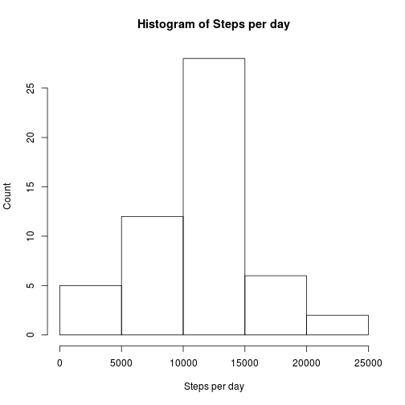
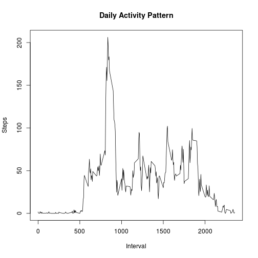
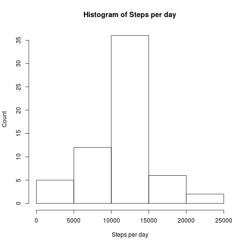
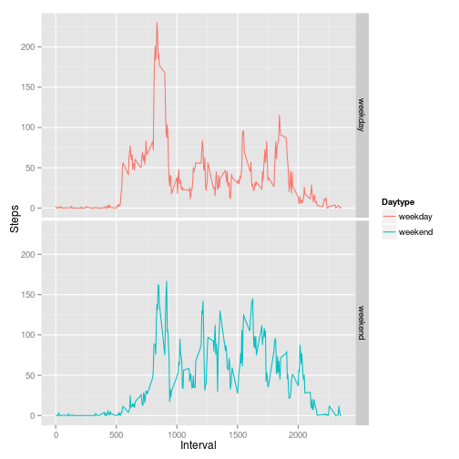

## Loading and preprocessing the data

```r
pdata <- read.csv(unz("activity.zip","activity.csv"))
perday <- aggregate(pdata$steps,by=list(Date = pdata$date), FUN=sum)
```

## What is the mean total number of steps taken per day?
First, we'll display a histogram.

```r
hist(perday$x, main="Histogram of Steps per day", xlab="Steps per day", ylab="Count")
```

 

Then a quick calculation of mean and median, ignoring NA.


```r
meanperday <- mean(perday$x, na.rm = T)
medianperday <- median(perday$x, na.rm = T)
```

So the mean is 1.0766189 &times; 10<sup>4</sup> and the median is 10765.

## What is the average daily activity pattern?

```r
perinterval <- aggregate(pdata$steps, by=list(Interval = pdata$interval), FUN="mean", na.rm = TRUE, na.action="na.pass")
plot(perinterval$Interval,perinterval$x, type="l", main="Daily Activity Pattern", xlab="Interval", ylab="Steps")
```

 

Which looks reasonable, people start up going to work around 5am, walk around during working hours, then become sedentary in the evening and barely move from midnight on. The interval with most stepping is 835.

## Imputing missing values

The total number of NAs in the data is 2304. Of these, 2304 , all of them, are in the steps column. Let's impute some!


```r
newdata <- pdata
newdata$steps <- ifelse(is.na(pdata$steps),perinterval$x,pdata$steps)
```

Our histogram now looks like this:

```r
newperday <- aggregate(newdata$steps,by=list(Date = newdata$date), FUN=sum)
hist(newperday$x, main="Histogram of Steps per day", xlab="Steps per day", ylab="Count")
```

 

And our new mean and median:


```r
newmeanperday <- mean(newperday$x)
newmedianperday <- median(newperday$x)
```

So the mean is 1.0766189 &times; 10<sup>4</sup> (a difference of 0 ) and the median is 1.0766189 &times; 10<sup>4</sup> (a difference of 1.1886792 ).

The impact is (perhaps predictably) pretty small.

## Are there differences in activity patterns between weekdays and weekends?
Let's divide the data between weekdays and weekends with the chron library

```r
library(chron)
library(ggplot2)
newdata$weekday <- ifelse(is.weekend(newdata$date),"weekend","weekday")
newdata$weekday <- factor(newdata$weekday)
aggnew <- with(newdata, aggregate(steps , by=list(Interval = interval, Daytype = weekday), FUN=mean))
names(aggnew) <- c("Interval", "Daytype", "Steps")
g <- qplot(Interval, 
           Steps, 
           data = aggnew, 
           color = Daytype,
           geom=c("line"),
            facets = Daytype ~ .)
print(g)
```

 

